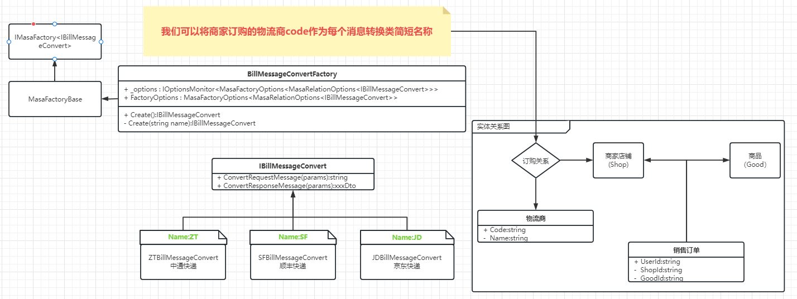

# 序言

>  **闲来无聊，前段时间发现一个.net开源框架：masa framework。经过一些小型项目使用，发现确实挺不错的。然后我又去阅读了整个masa framework源码，特此来记录整个源码阅读的过程。**


# MASA Framework简介

​		[**Masa Framework**](https://github.com/masastack/MASA.Framework)是 [**masa stack**](https://masastack.com/) 系列中用于开发web系统的框架，它能够帮助我们技术团队在 **传统三层架构**、**DDD领域驱动** 形态随意切换，以便满足我们技术团队不同时期的需求，防止因公司业务扩张而更换技术框架带来的一系列成本。


# MASA Framework组成

 ## 概述

 MASA Framework主要由三部分组成，分别是：**BuildingBlocks（抽象层）**、**Contrib（BuildingBlocks的实现）**、**Utils（工具库）** 。当然官方称BuildingBlocks叫做构建块，其实我看了下源码，就是把我们日常开发需要用到的东西（例如：多租户、多语言、仓储、配置中心、基础业务等等等等）抽象了一层，抽象出一个BuildingBlocks**以便我们可以随意替换掉官方的实现，从而具备更高的扩展性**（PS：官方库自由度还是挺高的）。

 

 ## 模块组成

>  Masa Framework主体部分主要由19个模块组成，它涵盖了我们日常开发所需的所有组件，是一个大而全的框架。主要由以下组成：


# Masa Framework底层-构建工厂设计

## 一个实际项目中的场景

接下来让我们看下Masa Framework框架起点的设计：MasaFactory（构建工厂）（PS：构建工厂这个名字是我取得），之所以从这个工厂说起，是因为其他模块都是用的这个工厂模式。大家都知道我们日常项目中开发都会用到依赖注入，IOC容器。虽然微软官方也提供了IServiceCollection，但是面对一个接口多种实现的模式，官方只能注入IEnumerable集合，而定位某个具体的实现类就比较困难。例如：

* 场景：在物流仓储系统中，当仓储收到销售订单发货时，需要申请物流面单，不同商家店铺可能订购了不同的快递服务。A商家店铺订购了顺丰、B商家店铺订购了中通，那么我们在申请物流面单（运单号，纸质运单打印）的时候，由于每家快递的请求和返回信息不同，就会有以下这种设计：一个面单消息转换接口，多个快递商的消息转换实现

​	

对于这种多实现的问题，MASA Framework的构建工厂是怎么优雅的解决呢？

## 使用MASA Framework 构建工厂解决这个问题

>  首先第一步大家把源码当下来，源码地址：https://github.com/masastack/MASA.Framework

我们点开源码，先看```Masa.BuildingBlocks.Data.Contracts``` 这个类库的设计

MASA Framework的构建工厂通过options配置，可以给接口的每个实现类赋予一个简短的名称，然后通过工厂类的Create方法根据传入不同的名称，来创建对应的实例。我们来看下利用masa的构建工厂设计面单请求消息的设计图：



这样我只需要传入一个简短的名称，就能创建对应的面单消息转换类，是不是比IEnumerable集合方便呢？写再多理论也不如实操一次，下面进入我们的代码环节。

## demo项目示例

* demo项目地址：https://github.com/MapleWithoutWords/masa-demos

> 这边以上诉的物流面单申请为例子，不同的销售订单对应的商家店铺，每个商家店铺订购的物流商不同，使用masa framework构建工厂来实现不同物流商的面单申请，在使用层面无感的效果。

1. 首先我们先创建一个webapi项目，然后安装 ```Masa.BuildingBlocks.Data.Contracts``` 这个包，并把上面的物流面单消息转换的类和接口创建好，如下图所示：


2. 第二步，创建 ```BillMessageConvertFactory``` 工厂类，并继承自MasaFactoryBase<IBillMessageConvert, MasaRelationOptions<<IBillMessageConvert>> 类

```c#
public class BillMessageConvertFactory : MasaFactoryBase<IBillMessageConvert, MasaRelationOptions<IBillMessageConvert>>
{
    protected override string DefaultServiceNotFoundMessage => "Default BillMessageConvert not found, you need to add it";

    protected override string SpecifyServiceNotFoundMessage => "Please make sure you have used [{0}] BillMessageConvert, it was not found";

    protected override MasaFactoryOptions<MasaRelationOptions<IBillMessageConvert>> FactoryOptions => _optionsMonitor.CurrentValue;


    private readonly IOptionsMonitor<MasaFactoryOptions<MasaRelationOptions<IBillMessageConvert>>> _optionsMonitor;

    public BillMessageConvertFactory(IServiceProvider serviceProvider) : base(serviceProvider)
    {
        _optionsMonitor = serviceProvider.GetRequiredService<IOptionsMonitor<MasaFactoryOptions<MasaRelationOptions<IBillMessageConvert>>>>();
    }
}
```

3. 添加一个```IServiceCollection``` 扩展类 ```IServiceCollectionExtensions``` 用于注入工厂

```c#
public static class IServiceCollectionExtensions
{
    public static void AddBillMessageConvertServices(this IServiceCollection services)
    {
        services.AddTransient(typeof(JDBillMessageConvert));
        services.AddTransient(typeof(SFBillMessageConvert));
        services.AddTransient(typeof(ZTBillMessageConvert));
        services.Configure<MasaFactoryOptions<MasaRelationOptions<IBillMessageConvert>>>(opt =>
        {
            opt.AddService("JD", typeof(JDBillMessageConvert))
            .AddService("SF", typeof(SFBillMessageConvert))
            .AddService("ZT", typeof(ZTBillMessageConvert));
        });
        services.AddSingleton<IMasaFactory<IBillMessageConvert>, BillMessageConvertFactory>();
    }

    public static MasaFactoryOptions<MasaRelationOptions<IBillMessageConvert>> AddService(this MasaFactoryOptions<MasaRelationOptions<IBillMessageConvert>> factoryOptions, string name, Type implType)
    {
        if (factoryOptions.Options.Any(e => e.Name == name))
        {
            return factoryOptions;
        }


        var relationOptions = new MasaRelationOptions<IBillMessageConvert>(name, serviceProvider =>
        {
            return (IBillMessageConvert)serviceProvider.GetRequiredService(implType);
        });

        factoryOptions.Options.Add(relationOptions);

        return factoryOptions;
    }
}
```

4. 创建一个```OutboundController`` 控制器类，在构造函数中注入 IMasaFactory<IBillMessageConvert> 对象，如下所示

```c#
[Route("api/[controller]")]
[ApiController]
public class OutboundController : ControllerBase
{
    private readonly IMasaFactory<IBillMessageConvert> _billMessageConvertFactory;

    public OutboundController(IMasaFactory<IBillMessageConvert> billMessageConvertFactory)
    {
        _billMessageConvertFactory = billMessageConvertFactory;
    }

    /// <summary>
    /// 获取物流面单
    /// </summary>
    /// <param name="saleOrderId">销售订单id</param>
    /// <returns></returns>
    [HttpGet]
    public async Task<string> GetBillAsync(int saleOrderId = 0)
    {
        //TODO:根据订单id获取订单信息
        var saleOrderInfo = new { GoodId = 1, GoodName = "星巴克咖啡豆", ShopId = 1, ShopName = "星巴克专卖店", UserId = 1, UserName = "张三", UserPhone = "18888888888", UserAddress = "新疆省克拉玛依市" };
        string logisticsProviderCode = "SF";
        if (saleOrderId == 1)
        {
            logisticsProviderCode = "ZT";
        }
        else if (saleOrderId == 2)
        {
            logisticsProviderCode = "JD";
        }

        var billMessageConvert = _billMessageConvertFactory.Create(logisticsProviderCode);
        var requestMessage = await billMessageConvert.ConvertRequestMessage(new BillRequestDto
        {
            GoodId = saleOrderInfo.GoodId,
            GoodName = saleOrderInfo.GoodName,
            SaleOrderId = saleOrderId,
            ShopId = saleOrderInfo.ShopId,
            ShopName = saleOrderInfo.ShopName,
            UserAddress = saleOrderInfo.UserAddress,
            UserId = saleOrderInfo.UserId,
            UserName = saleOrderInfo.UserName,
            UserPhone = saleOrderInfo.UserPhone,
        });
        //TODO:发送http请求
        string responseStr = "";
        var responseMessage = await billMessageConvert.ConvertResponseMessage(responseStr);

        return $"Request Message:【{requestMessage}】。Response Message：【{responseMessage.BillNo}】";
    }
}
```

5. 运行项目，最终的效果如下：（PS：这边模拟不同订单对应不同的物流商，然后去申请运单号为例子）

   


# 总结

>  在面对一个接口多实现的场景，终于不用再用IEnumerable集合去做各种筛选来实现效果，只需要增加一个工厂类就行了


# 最后

MASA Framework的其它模块其实都用到这个设计，我们可以替换掉官方的实现，也可以官方的实现和自己的实现在程序内共存。

比如： ```Service Caller``` 这个模块，既可以用dapr的服务调用，也可以使用http的服务调用。

