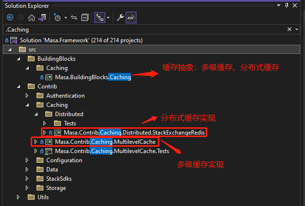

# Masa Framework源码解读-缓存设计（分布式缓存进阶之多级缓存）

## 序言

​		今天这篇文章来看看Masa Framework的缓存设计，上一篇文章中说到的MasaFactory的应用也会在这章节出现。文章中如有错误之处还请指点，咱们话不多说，直入主题。

## Masa Framework缓存简介

> MASA Framework源码地址：https://github.com/masastack/MASA.Framework

​		Masa Framework中的缓存组件支持 **```分布式缓存```** 和 **```分布式多级缓存```** （PS：**Masa Framework的缓存组件并不与框架强行绑定，也就是说我们可以在自己的框架中使用masa framework的缓存组件，而不是我必须用masa framework才能使用它的缓存组件，这一点必须给官方点个大大的赞**)。首先分布式缓存大家多多少少都听说过也用过，在这不多介绍分布式缓存的概念。我们来看下多级缓存吧，其实多级缓存这个概念很早就有，但是在.net中没怎么看到这个设计的落地实现框架，今天刚好借着解读masa framework的源码，我们来看下多级缓存设计。

## 多级缓存的定义

> 什么是多级缓存？既然已经有了分布式缓存，为什么还要多级缓存？

​		首先什么是多级缓存？多级缓存是指在一个系统的不同架构层级进行数据缓存，以提升访问效率。其次有了分布式缓存，为什么还要多级缓存？是因为在读取数据频率很高的情况下，分布式缓存面临着两个问题：响应速度和高可用。响应速度问题是指当访问层发一起一个网络请求到分布式缓存处理完请求返回的时间，是需要一个过程，而网络请求的不确定性以及耗时时长是不可避免的。而高可用问题是指大量读取数据请求过来读取缓存的时候，分布式缓存能否扛得住这么大的压力，当然这个有解决方案可以使用集群解决，但是集群之后会有数据一致性问题并且它读取数据还是得走网络通信。

​		而多级缓存就是为了优化分布式缓存存在的一些问题，而衍生另一种手段。所谓多级缓存可以简单理解为是通过在分布式缓存和我们的访问层中间在增加若干层缓存来减少对分布式缓存的网络请求和分布式缓存的压力。（PS：**多级缓存存在的数据一致性问题，这个Masa Framework已经帮我们解决了**）


## MASA Framework中的多级缓存设计

 首先Masa Framework有一套分布式缓存接口及实现，而Masa Framework的多级缓存是在分布式缓存的基础上，在加了一层内存缓存。而多级缓存数据的一致性问题，masa framework是通过redis的pub、sub发布订阅解决的（PS：这块的发布订阅官方有一个抽象，并不直接依赖redis，请往下看）。

* 当访问层读取缓存数据时，先从内存里面获取下，如果没有则向分布式缓存获取并写入到内存缓存，并且同时开启一个关于缓存key的分布式订阅，如果收到消息则同步更新内存缓存。

* 当访问层写入缓存时，同时写入内存以及分布式缓存，然后再发布关于缓存key的分布式消息，其它客户端收到消息时则同步更新各自内存缓存数据。


## 源码解读

> 接下来让我们来看下Masa Framework的源码设计，首先我们把源码下载下来，然后打开。下载地址：https://github.com/masastack/MASA.Framework

### 源码目录结构

* masa framework缓存组件分为两部分，一个是BuildingBlocks下的Caching抽象接口，另外一个是Contrib下的Caching接口实现。结构如下图：



### 代码设计

>  Masa Framework整个缓存组件分为三个类库项目，分别是：```Masa.BuildingBlocks.Caching```、```Masa.Cotrib.Caching.Distributed.StackExchangeRedis```、```Masa.Contrib.Caching.MultilevelCache```  。

​		首先**```Masa.BuildingBlocks.Caching```**这个类库就是将我们经常用到的缓存方法抽象了一层（IDistributedCacheClient、IMultilevelCacheClient），其中包含分布式缓存以及多级缓存常用的方法，如：Get、Set、Refresh、Remove，分布式缓存中的（Subscribe、Publish等）。

​		而**```Masa.Cotrib.Caching.Distributed.StackExchangeRedis ```**这个类库实现了分布式缓存（PS：这个库没有实现多级缓存IMultilevelCacheClient接口，个人觉得其实应该将Masa.BuildingBlocks.Caching这个类库再拆分出两个包，将分布式和多级缓存分开）。

​		最后**```Masa.Contrib.Caching.MultilevelCache```**这个类库实现了多级缓存（这个类库没有实现分布式缓存IDistributedCacheClient接口，但是多级缓存依赖了IDistributedCacheClient）。最终整个缓存的设计如下图所示：


* ```Masa.BuildingBlocks.Caching``` ：这个类库包含了分布式缓存和多级缓存的抽象接口以及抽象基类
  * ```ICacheClient```：缓存公共方法抽象（把多级缓存和分布式缓存都有的方法在封装一层，如：Get、Set、Refersh等方法）
  * ```CacheClientBase``` ：缓存抽象基类，对方法进行封装（比如Get、GetList，最终都调用GetList方法等）
  * ```IDistributedCacheClient``` ：分布式缓存接口抽象（Get、Set、Refersh、Publish、Subscribe等方法）,继承```ICacheClient``` 。
  * ```DistributedCacheClientBase``` ：分布式缓存抽象基类，对方法进行封装（比如Get、GetList，最终都调用GetList方法等）
  * ```IMultilevelCacheClient``` ：多级缓存接口抽象（Get、Set、Refersh等方法）,继承```ICacheClient``` 。
  * ```MultilevelCacheClientBase``` ：多级缓存抽象基类，对方法进行封装（比如Get、GetList，最终都调用GetList方法等）
  * 构建工厂
    * ```ICacheClientFactory<TService> ```：缓存工厂抽象，继承自```IMasaFactory<TService> ``` [构建工厂](https://www.cnblogs.com/norain/p/17180328.html)。
    * ```CacheClientFactoryBase<TService>``` ：缓存工厂抽象基类，继承自```MasaFactoryBase<TService>``` 。
    * ```IDistributedCacheClientFactory``` ：用于创建分布式缓存```IDistributedCacheClient``` 接口，继承自```ICacheClientFactory<IDistributedCacheClient> ``` 。
    * ```DistributedCacheClientFactoryBase``` ：分布式缓存创建工厂实现类，创建```IDistributedCacheClient``` 接口实例。
    * ```IMultilevelCacheClientFactory``` ：用于创建多级缓存```IMultilevelCacheClient``` 接口，继承自```ICacheClientFactory<IMultilevelCacheClient> ``` 。
    * ```MultilevelCacheClientFactoryBase``` ：多级缓存创建工厂实现类，创建```IMultilevelCacheClient``` 接口实例。
* ```Masa.Cotrib.Caching.Distributed.StackExchangeRedis``` ： 分布式缓存```IDistributedCacheClient```接口的实现
  * ```RedisCacheClientBase``` ：redis实现分布式缓存接口，进行再一步封装，将redis连接、订阅、配置等初始化。继承```DistributedCacheClientBase```
  * ```RedisCacheClient``` ：分布式缓存的redis实现，继承```RedisCacheClientBase``` 

* ```Masa.Contrib.Caching.MultilevelCache``` ：多级缓存实现
  * MultilevelCacheClient ：多级缓存实现，内部依赖```IDistributedCacheClient``` 。

> 整个缓存组件的设计，最主要类是这些，当然还有一些option配置和帮助类，我就没有画出来，这个留待大家自己去看源码


## Demo案例

> 上面也说到Masa Framework的缓存组件不与框架强绑定，也就是说我们可以在自己的框架中使用masa的缓存组件，下面我将展示两个项目，它们分别使用分布式缓存和多级缓存。

### 分布式缓存使用demo


### 多级缓存使用demo


## 总结

